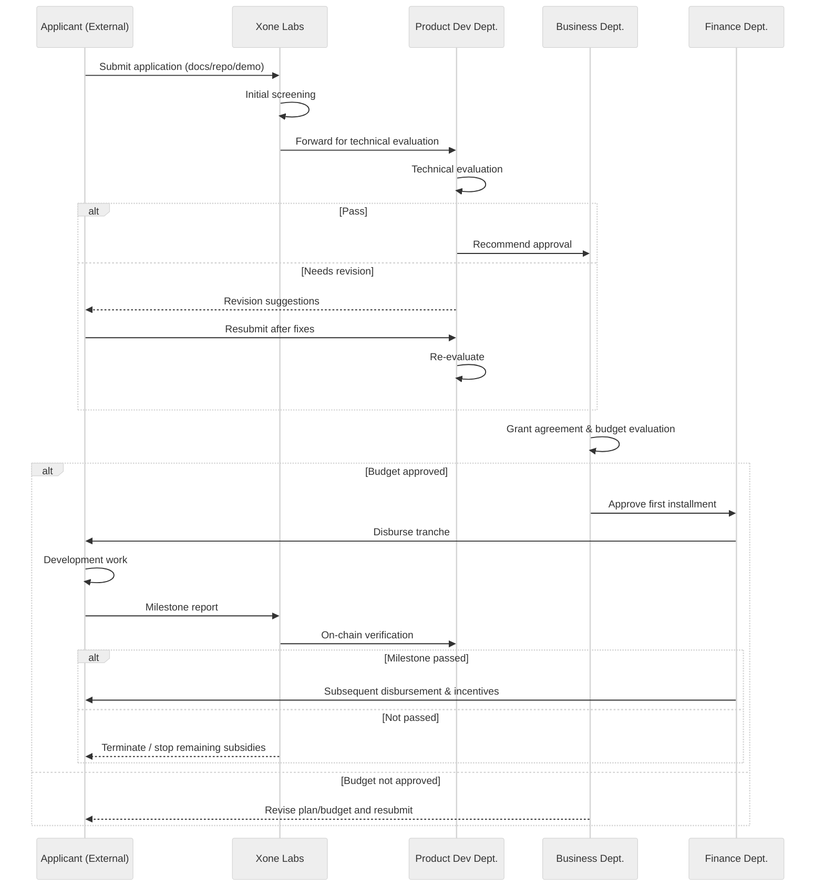

import {Table, TableHeader, TableColumn, TableBody, TableRow, TableCell, Card, CardHeader, CardBody, CardFooter, Divider, Link, Image, Button} from "@nextui-org/react";
import ContactInfo from "@/components/ContactInfo";
import { Callout } from 'nextra/components'

# Grant-Xone Ecosystem Support Subsidy Program

## 1. Project Vision

Amid the wave of Web3, Xone Chain firmly believes that developers are the true driving force of the ecosystem. To unlock the innovative potential of global developers, foster ecosystem prosperity, boost TVL, and create user value, Xone has launched the official **Xone Grant Program**. Through multi-dimensional incentives — including financial support, technical assistance, market resources, and governance participation — the program empowers developers to build high-quality on-chain applications and infrastructure within the Xone ecosystem.

<Button
  href="https://forms.gle/U7yatCsQzY7LS1NY7"
  as={Link}
  className="top-6 rounded-md bg-primaryHue px-3.5 py-2.5 text-sm font-semibold text-white shadow-sm hover:bg-grd-500 focus-visible:outline focus-visible:outline-2 focus-visible:outline-offset-2"
  showAnchorIcon
  variant="solid"
  target="_blank"
>
  Apply Now
</Button>

## 2. What Types of Projects Do We Support?

Xone Grant focuses on six core areas, while also encouraging any creative projects that advance the progress of the Xone ecosystem.

  <Table removeWrapper aria-label="Xone Grant Supported Project Types" className="mt-2">
    <TableHeader>
      <TableColumn>**Category**</TableColumn>
      <TableColumn>**Supported Directions**</TableColumn>
    </TableHeader>
    <TableBody>
      <TableRow key="1">
        <TableCell>Infrastructure</TableCell>
        <TableCell>Wallets, explorers, cross-chain bridges, RPC nodes, developer tools</TableCell>
      </TableRow>
      <TableRow key="2">
        <TableCell>DeFi</TableCell>
        <TableCell>DEX, aggregators, staking, lending, stablecoin mechanisms</TableCell>
      </TableRow>
      <TableRow key="3">
        <TableCell>RWA</TableCell>
        <TableCell>Real estate, casinos, tokenization of physical assets, on-chain bond issuance</TableCell>
      </TableRow>
      <TableRow key="4">
        <TableCell>MemeFi</TableCell>
        <TableCell>Meme issuance platforms, blind boxes, genealogy & fission games</TableCell>
      </TableRow>
      <TableRow key="5">
        <TableCell>GameFi / SocialFi</TableCell>
        <TableCell>Highly interactive blockchain games, social asset platforms, NFT tools</TableCell>
      </TableRow>
      <TableRow key="6">
        <TableCell>Data Services & Risk Control</TableCell>
        <TableCell>Data dashboards, user behavior analytics, smart contract security tools</TableCell>
      </TableRow>
    </TableBody>
  </Table>

## 3. Application Requirements

To ensure project quality and efficient use of funds, the Xone Grant sets the following basic application requirements:

  <Table removeWrapper aria-label="Xone Grant Application Requirements" className="mt-2">
    <TableHeader>
      <TableColumn>**Requirement**</TableColumn>
      <TableColumn>**Description**</TableColumn>
    </TableHeader>
    <TableBody>
      <TableRow key="1">
        <TableCell>✅ Open Source Commitment</TableCell>
        <TableCell>Projects must follow mainstream open-source licenses (MIT / Apache 2.0 / GPL, etc.) and publish the codebase by a specified timeline.</TableCell>
      </TableRow>
      <TableRow key="2">
        <TableCell>✅ Minimum Viable Product (MVP)</TableCell>
        <TableCell>An initial prototype, DEMO, or GitHub Repo must be provided to demonstrate technical capability and implementation potential.</TableCell>
      </TableRow>
      <TableRow key="3">
        <TableCell>✅ Technical / Product Team Background</TableCell>
        <TableCell>At least one core technical member plus a project lead; must show development skills or relevant past experience.</TableCell>
      </TableRow>
      <TableRow key="4">
        <TableCell>✅ Clear Budget Plan</TableCell>
        <TableCell>A detailed budget allocation must be submitted, including manpower, technology, operations, marketing, etc.</TableCell>
      </TableRow>
      <TableRow key="5">
        <TableCell>✅ Blockchain Alignment</TableCell>
        <TableCell>Explain why Xone was chosen and how its on-chain features will be leveraged (e.g., low gas fees, BVI mining, genealogy system).</TableCell>
      </TableRow>
      <TableRow key="6">
        <TableCell>✅ Community Participation</TableCell>
        <TableCell>Commitment to engage with the Xone community, such as contributing documentation, organizing events, co-marketing, or governance voting.</TableCell>
      </TableRow>
    </TableBody>
  </Table>

## 4. Funding Models & Grant Amounts

We provide a tiered support system combining funding, resources, and in-depth guidance for builders at different stages and with varying needs. Our goal is empowerment with precision, not just subsidies.
The Xone Grant adopts a “Milestone + Verification” model, balancing quick project launches with on-chain performance, while avoiding resource waste.

  <Card className="flex-shrink-0 max-w-full flex-col">
    <CardHeader className="flex top-6 gap-2">
      

      

        
**Standard Grant**

      

    </CardHeader>
    <CardBody className="px-3 pt-0 pb-3 text-small">
      
For most ecosystem projects, grants are distributed through a <strong>Milestone + Verification</strong> process to ensure real progress and accountability.

    </CardBody>
  </Card>

  <Card className="flex-shrink-0 max-w-full flex-col">
    <CardHeader className="flex top-6 gap-2">
      

      

        
**Strategic Grant**

      

    </CardHeader>
    <CardBody className="px-3 pt-0 pb-3 text-small">
      
For projects with strategic impact on Xone, such as core infrastructure, DeFi protocols, or flagship GameFi projects.  
      • Funding Cap: up to <strong>500,000 XOC</strong>  
      • Requires multi-round evaluation & KYC by the Foundation Committee  
      • Benefits: On-chain promotion, co-branding, media exposure, CEX referral

    </CardBody>
  </Card>

  <Card className="flex-shrink-0 max-w-full flex-col">
    <CardHeader className="flex top-6 gap-2">
      

      

        
**Mini Grant**

      

    </CardHeader>
    <CardBody className="px-3 pt-0 pb-3 text-small">
      
For individual developers, hackathon participants, or educational content creators.  
      • One-time reward: <strong>1,000–5,000 XOC</strong>  
      • Must complete a specific contribution (e.g., developer docs, Dune dashboard, script tools)

    </CardBody>
  </Card>  

### Overall Structure (Three Subsidy Types)

  <Table removeWrapper aria-label="Xone Grant Subsidy Structure" className="mt-2">
    <TableHeader>
      <TableColumn>**Type**</TableColumn>
      <TableColumn>**Core Objective**</TableColumn>
      <TableColumn>**Subsidy Amount per Item**</TableColumn>
    </TableHeader>
    <TableBody>
      <TableRow key="1">
        <TableCell>1️⃣ Launch Incentive</TableCell>
        <TableCell>Rapid deployment and activation of the first batch of users</TableCell>
        <TableCell>10,000 – 50,000 XOC</TableCell>
      </TableRow>
      <TableRow key="2">
        <TableCell>2️⃣ Behavioral Subsidy</TableCell>
        <TableCell>Continuous user onboarding and genuine interaction behaviors</TableCell>
        <TableCell>5,000 – 100,000 XOC (staged release)</TableCell>
      </TableRow>
      <TableRow key="3">
        <TableCell>3️⃣ Advanced Incentive</TableCell>
        <TableCell>High-quality operation of premium projects and governance participation</TableCell>
        <TableCell>50,000 – 500,000 XOC (upon evaluation)</TableCell>
      </TableRow>
    </TableBody>
  </Table>

### Detailed Criteria & Subsidy Mapping

#### 🟩 1. Launch Incentive (One-time Release)

  <Table removeWrapper aria-label="Xone Grant Launch Incentive" className="mt-2">
    <TableHeader>
      <TableColumn>**Condition**</TableColumn>
      <TableColumn>**Subsidy Amount**</TableColumn>
      <TableColumn>**Assessment Details**</TableColumn>
    </TableHeader>
    <TableBody>
      <TableRow key="1">
        <TableCell>Project deployed on Xone Mainnet (Official PPT + Smart Contract Deployment + DApp Page Online)</TableCell>
        <TableCell>+10,000 XOC</TableCell>
        <TableCell>
          1. Official PPT 
          2. Smart contract deployed on-chain 
          3. DApp page online
        </TableCell>
      </TableRow>
      <TableRow key="2">
        <TableCell>Within 7 days after launch, complete ≥200 genuine on-chain user interactions (non-bot / non-airdrop addresses)</TableCell>
        <TableCell>+10,000 XOC</TableCell>
        <TableCell>
          1. 200+ genuine on-chain user interactions 
          2. Each user holds assets ≥ 100 USDT
        </TableCell>
      </TableRow>
      <TableRow key="3">
        <TableCell>Initial liquidity provision ≥ 20,000 USDT (or equivalent assets), TVL duration ≥ 90 days</TableCell>
        <TableCell>+10,000 XOC</TableCell>
        <TableCell>
          1. Initial liquidity ≥ 20,000 USDT (or equivalent) 
          2. TVL maintained ≥ 90 days
        </TableCell>
      </TableRow>
      <TableRow key="4">
        <TableCell>Official Xone media exposure (AMA, Tweet, Space)</TableCell>
        <TableCell>+10,000 XOC</TableCell>
        <TableCell>
          1. At least 1 AMA 
          2. At least 1 KOL Tweet 
          3. At least 1 Space, with ≥1000 participants, ≥10,000 exposures
        </TableCell>
      </TableRow>
      <TableRow key="5">
        <TableCell>Build a community with ≥1000 active users (e.g., Telegram)</TableCell>
        <TableCell>+10,000 XOC</TableCell>
        <TableCell>
          1. ≥1000 active community members (Telegram, etc.)
        </TableCell>
      </TableRow>
      <TableRow key="6">
        <TableCell>✅ Maximum Launch Incentive Total</TableCell>
        <TableCell>50,000 XOC</TableCell>
        <TableCell>—</TableCell>
      </TableRow>
    </TableBody>
  </Table>

#### 🟨 2. Behavioral Incentive (Staged Release)

  <table className="w-full border border-gray-200 dark:border-gray-700 text-sm">
    <thead className="bg-gray-100 dark:bg-gray-800 text-gray-900 dark:text-gray-100">
      <tr>
        <th className="w-28 border border-gray-200 dark:border-gray-700 px-4 py-3 text-left">Application Conditions</th>
        <th className="border border-gray-200 dark:border-gray-700 px-4 py-3 text-left">Metrics / Locking Behavior</th>
        <th className="border border-gray-200 dark:border-gray-700 px-4 py-3 text-left" colSpan={2}>
          Subsidy / Settlement Method
        </th>
      </tr>
    </thead>

    <tbody className="text-gray-900 dark:text-gray-100">
      <tr>
        <td className="border border-gray-200 dark:border-gray-700 px-4 py-3 text-center font-medium align-middle" rowSpan={4}>
          Achieved
        </td>

        <td className="border border-gray-200 dark:border-gray-700 px-4 py-3">
          1. User TVL ≥ 100,000 USDT 
          2. TVL duration: 30–90 days
        </td>

        <td className="border border-gray-200 dark:border-gray-700 px-4 py-3">
          5% XOC of monthly incremental TVL
        </td>

        <td className="border border-gray-200 dark:border-gray-700 px-4 py-3 align-middle text-center" rowSpan={4}>
          70% settled in the same month; 
          Remaining 30% released in the following month after verifying TVL performance is not below 50%
        </td>
      </tr>

      <tr>
        <td className="border border-gray-200 dark:border-gray-700 px-4 py-3">
          1. User TVL ≥ 200,000 USDT 
          2. TVL duration: 90–180 days
        </td>
        <td className="border border-gray-200 dark:border-gray-700 px-4 py-3">
          6% XOC of monthly incremental TVL
        </td>
      </tr>

      <tr>
        <td className="border border-gray-200 dark:border-gray-700 px-4 py-3">
          1. User TVL ≥ 500,000 USDT 
          2. TVL duration: 180–365 days
        </td>
        <td className="border border-gray-200 dark:border-gray-700 px-4 py-3">
          7% XOC of monthly incremental TVL
        </td>
      </tr>

      <tr>
        <td className="border border-gray-200 dark:border-gray-700 px-4 py-3">
          1. User TVL ≥ 1,000,000 USDT 
          2. TVL duration: ≥ 365 days
        </td>
        <td className="border border-gray-200 dark:border-gray-700 px-4 py-3">
          8% XOC of monthly incremental TVL
        </td>
      </tr>

      <tr className="bg-gray-100 dark:bg-gray-800">
        <td className="border border-gray-200 dark:border-gray-700 px-4 py-3 font-medium text-center">Notes</td>
        <td className="border border-gray-200 dark:border-gray-700 px-4 py-3" colSpan={3}>
          1. No subsidy if TVL performance declines in the second month; 
          2. If TVL performance later increases and exceeds the direct subsidy baseline, subsidies will continue to be granted.
        </td>
      </tr>
    </tbody>
  </table>

#### 🟥 3. Advanced Incentives (Application-Based)

  <Table removeWrapper aria-label="Xone Grant Advanced Incentives" className="mt-2">
    <TableHeader>
      <TableColumn>Condition</TableColumn>
      <TableColumn>Subsidy Amount</TableColumn>
    </TableHeader>
    <TableBody>
      <TableRow key="1">
        <TableCell>DID identity binding ≥ 10,000</TableCell>
        <TableCell>50,000 XOC</TableCell>
      </TableRow>
      <TableRow key="2">
        <TableCell>Project governance participation ≥ 500 votes</TableCell>
        <TableCell>50,000 XOC</TableCell>
      </TableRow>
      <TableRow key="3">
        <TableCell>XOC staking ≥ 3,000,000 (with ≥ 600,000 individual stake)</TableCell>
        <TableCell>100,000 XOC</TableCell>
      </TableRow>
      <TableRow key="4">
        <TableCell>Joint incubation with Labs, media exposure covering > 500,000 users</TableCell>
        <TableCell>100,000 – 200,000 XOC</TableCell>
      </TableRow>
      <TableRow key="5">
        <TableCell>Meeting Tier-1 exchange partnership recommendation requirements (BD relationships, compliance docs, etc.)</TableCell>
        <TableCell>200,000 – 500,000 XOC</TableCell>
      </TableRow>
      <TableRow key="6">
        <TableCell>✅ Maximum Cap</TableCell>
        <TableCell>500,000 XOC(Requires execution plan & Foundation approval vote)</TableCell>
      </TableRow>
    </TableBody>
  </Table>

### Subsidy Mechanism Rules

  <Table removeWrapper aria-label="Xone Grant Subsidy Mechanism Rules" className="mt-2">
    <TableHeader>
      <TableColumn>Rule Category</TableColumn>
      <TableColumn>Content</TableColumn>
    </TableHeader>
    <TableBody>
      <TableRow key="1">
        <TableCell>Disbursement Method</TableCell>
        <TableCell>Subsidies are distributed in stages from the “XOC Incentive Account” on-chain, bound to the project wallet or a designated responsible address.</TableCell>
      </TableRow>
      <TableRow key="2">
        <TableCell>Risk Control</TableCell>
        <TableCell>Implements “fast issuance + slow release + behavior verification” to strictly prevent wash trading; all subsidies must pass on-chain behavior verification.</TableCell>
      </TableRow>
      <TableRow key="3">
        <TableCell>Behavior Verification Standard</TableCell>
        <TableCell>Wallet addresses must meet filtering logic: non-contract address, non-airdrop, non-bot/zombie accounts; validated by interactions, asset holdings, and staking.</TableCell>
      </TableRow>
      <TableRow key="4">
        <TableCell>Passive Elimination Mechanism</TableCell>
        <TableCell>If no new users for 30 consecutive days, or TVL drops by 50%, remaining subsidies will be halted.</TableCell>
      </TableRow>
      <TableRow key="5">
        <TableCell>Subsidy Recovery Clause</TableCell>
        <TableCell>If fraudulent data, cross-chain wash trading, or malicious arbitrage is detected, subsidies will be reclaimed and the project will be blacklisted.</TableCell>
      </TableRow>
    </TableBody>
  </Table>

## 5. Evaluation Criteria

  <Table removeWrapper aria-label="Xone Grant Evaluation Criteria" className="mt-2">
    <TableHeader>
      <TableColumn>Dimension</TableColumn>
      <TableColumn>Weight</TableColumn>
      <TableColumn>Description</TableColumn>
    </TableHeader>
    <TableBody>
      <TableRow key="1">
        <TableCell>Technical Strength</TableCell>
        <TableCell>30%</TableCell>
        <TableCell>Team background, code quality, project architecture</TableCell>
      </TableRow>
      <TableRow key="2">
        <TableCell>Innovative Value</TableCell>
        <TableCell>20%</TableCell>
        <TableCell>Addresses pain points / innovative business model</TableCell>
      </TableRow>
      <TableRow key="3">
        <TableCell>On-chain Alignment</TableCell>
        <TableCell>20%</TableCell>
        <TableCell>Leverages Xone features (Genealogy System, BVI, XOC/USDX)</TableCell>
      </TableRow>
      <TableRow key="4">
        <TableCell>User Expectation</TableCell>
        <TableCell>15%</TableCell>
        <TableCell>Growth potential (TVL, DID, user behaviors)</TableCell>
      </TableRow>
      <TableRow key="5">
        <TableCell>Community Value</TableCell>
        <TableCell>15%</TableCell>
        <TableCell>Contributions to the ecosystem (events, education, governance)</TableCell>
      </TableRow>
    </TableBody>
  </Table>

## 6. Our application process

- Response time: 10–15 business days
- Official support languages: English / Chinese

## 7. Other Support

- ✅ One-click token issuance + DEX automatic order placement tool
- ✅ Xone Labs incubator integration service
- ✅ Community ambassador joint promotion resources
- ✅ Official Twitter / Space promotion and promotion integration
- ✅ Hackathon priority participation
- ✅ Chainlist, DeBank, and Dune template support

## 8. FAQ

1. Is there a restriction on project regions?

We welcome applications from teams worldwide, with no geographical barriers. However, due to compliance and risk control requirements, the following principles apply:

- **Compliance with local laws**: The applicant’s jurisdiction must legally allow blockchain/Web3 R&D, operations, and funding acceptance. If the jurisdiction enforces a **total ban or strict licensing** on virtual asset activities (and no license is obtained), the application may be delayed or rejected.  
- **International sanctions screening**: Projects from **sanctioned regions**, or controlled by **sanctioned individuals/entities**, are ineligible (lists include UN, OFAC (U.S.), EU, UK, etc.).  
- **Export control & compliance evidence**: Projects involving cryptographic technology, software, or cross-border data transfer must follow **export control** and compliance rules. If uncertainty exists, applicants may be asked to provide a **legal opinion** or compliance certificate.  
- **Boundary & exceptions**: For regions with unclear regulation, applicants can provide **self-compliance proof** (e.g., business registration, proof of legal operations, local law firm opinion). We will evaluate on a case-by-case basis.  

> Note: We do not make legal commitments for any jurisdiction; please seek compliance advice before applying.

2. Can I apply multiple times?

- **Different projects can apply separately**: A single team’s **different projects/sub-products** may apply independently.  
- **Same project requires milestone completion**: If applying for the same project’s next round, the previous milestones must be achieved and deliverables submitted (repo, release notes, testnet/mainnet proof, user data, or reports).  
- **Cooldown & parallel restrictions**: A **90-day cooldown** is suggested before reapplying; the same project cannot apply for multiple grants simultaneously (to prevent duplicate funding).  
- **Total cap & frequency control**: Based on track record, impact, and financial health, we may set **annual caps and frequency limits** to ensure fairness and transparent fund allocation.  

3. Can commercial projects apply?

- **Yes, commercial projects may apply**: The condition is that they must be **partially or fully open-source**, or provide **public goods/services** (e.g., APIs, dev tools, educational content).  
- **Minimum open-source delivery**: At least the **core modules directly related to the grant** must be open-sourced (e.g., protocol upgrades, contract libraries, SDK/CLI, node tools, indexers), under an **OSI-approved license** (MIT/Apache-2.0/GPL, etc.).  
- **Public usability requirement**: If choosing “open service” instead of open code, access must be **publicly verifiable** and maintained for **≥12 months**, ensuring reproducibility and preventing closed-source lock-in/paywalls.  
- **IP & re-licensing**: Outputs funded by the grant usually require **non-exclusive, global, irrevocable reuse rights** for sustainability, while respecting your commercial rights.  
- **Transparency & disclosure**: Token issuance, monetization models, or related-party transactions must be **fully disclosed** in the application and follow community transparency guidelines.  

4. Can grants be received in fiat/USDT?

- **Current method**: Only **on-chain XOC disbursement**, in milestone-based installments, with **multi-sig support** for security.  
- **Future plan**: Evaluation is underway for stablecoin (USDT/USDC) disbursement; updates will be published if implemented.  
- **Compliance & KYC/AML**: For certain grant sizes or regions, **basic KYC/AML** checks may be required (for legal entities or designated recipients) to meet anti-money laundering and sanctions obligations.  
- **Fund usage & reporting**: Grants must be used for deliverables-related R&D, audits, infra, and community building. **Progress reports and expense breakdowns** may be requested for disbursement verification.  
- **Risks & costs**: On-chain disbursement involves **price volatility and gas fees**; applicants should account for budget buffers.  

<Callout>
At Xone, we provide not only funding but also the fertile ground for growth.\
Whether you're a startup or a scaling Web3 protocol, as long as you have ideas and actions, we're committed to being your strongest supporter.
</Callout>

<ContactInfo />