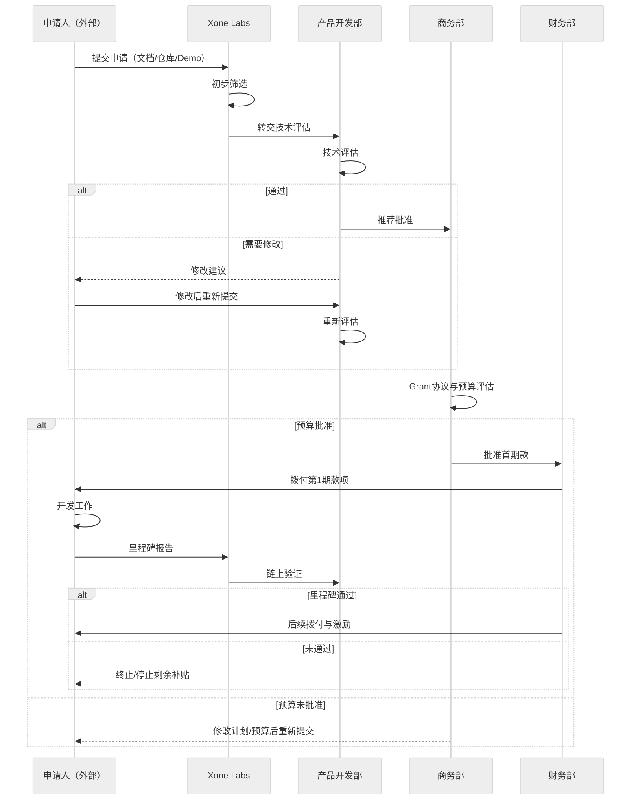

import {Table, TableHeader, TableColumn, TableBody, TableRow, TableCell, Card, CardHeader, CardBody, CardFooter, Divider, Link, Image, Button} from "@nextui-org/react";
import ContactInfo from "@/components/ContactInfo";
import { Callout } from 'nextra/components'

# Grant-Xone 生态支持补贴计划

## 1. 项目愿景

在 Web3 的浪潮中，Xone Chain 坚信开发者才是生态的真正推动力。为释放全球开发者的创新潜力，促进生态繁荣，提升 TVL，创造用户价值，Xone 正式推出官方 **Xone Grant 计划**。通过资金支持、技术协助、市场资源、治理参与等多维度激励，赋能开发者在 Xone 生态中构建高质量的链上应用与基础设施。

<Button
  href="https://forms.gle/U7yatCsQzY7LS1NY7"
  as={Link}
  className="top-6 rounded-md bg-primaryHue px-3.5 py-2.5 text-sm font-semibold text-white shadow-sm hover:bg-grd-500 focus-visible:outline focus-visible:outline-2 focus-visible:outline-offset-2"
  showAnchorIcon
  variant="solid"
  target="_blank"
>
  立即申请
</Button>

## 2. 我们支持哪些类型的项目？

Xone Grant 聚焦六大核心方向，同时也鼓励任何推动 Xone 生态进步的有创意项目。

  <Table removeWrapper aria-label="Xone Grant 支持的项目类型" className="mt-2">
    <TableHeader>
      <TableColumn>**类别**</TableColumn>
      <TableColumn>**支持方向**</TableColumn>
    </TableHeader>
    <TableBody>
      <TableRow key="1">
        <TableCell>基础设施</TableCell>
        <TableCell>钱包、浏览器、跨链桥、RPC 节点、开发者工具</TableCell>
      </TableRow>
      <TableRow key="2">
        <TableCell>DeFi</TableCell>
        <TableCell>DEX、聚合器、质押、借贷、稳定币机制</TableCell>
      </TableRow>
      <TableRow key="3">
        <TableCell>RWA</TableCell>
        <TableCell>房地产、赌场、实体资产代币化、链上债券发行</TableCell>
      </TableRow>
      <TableRow key="4">
        <TableCell>MemeFi</TableCell>
        <TableCell>Meme 发行平台、盲盒、族谱与裂变游戏</TableCell>
      </TableRow>
      <TableRow key="5">
        <TableCell>GameFi / SocialFi</TableCell>
        <TableCell>高交互性链游、社交资产平台、NFT 工具</TableCell>
      </TableRow>
      <TableRow key="6">
        <TableCell>数据服务与风控</TableCell>
        <TableCell>数据看板、用户行为分析、智能合约安全工具</TableCell>
      </TableRow>
    </TableBody>
  </Table>

## 3. 申请要求

为确保项目质量与资金使用效率，Xone Grant 设定以下基本申请要求：

  <Table removeWrapper aria-label="Xone Grant 申请要求" className="mt-2">
    <TableHeader>
      <TableColumn>**要求**</TableColumn>
      <TableColumn>**说明**</TableColumn>
    </TableHeader>
    <TableBody>
      <TableRow key="1">
        <TableCell>✅ 开源承诺</TableCell>
        <TableCell>项目须遵循主流开源协议（MIT / Apache 2.0 / GPL 等），并按时间线公布代码库。</TableCell>
      </TableRow>
      <TableRow key="2">
        <TableCell>✅ 最小可行产品</TableCell>
        <TableCell>需提供初始原型、DEMO 或 GitHub 仓库，证明技术能力与实现潜力。</TableCell>
      </TableRow>
      <TableRow key="3">
        <TableCell>✅ 技术/产品团队背景</TableCell>
        <TableCell>至少一名核心技术成员加项目负责人；需展示开发技能或相关过往经验。</TableCell>
      </TableRow>
      <TableRow key="4">
        <TableCell>✅ 清晰预算计划</TableCell>
        <TableCell>需提交详细预算分配，包括人力、技术、运营、市场等。</TableCell>
      </TableRow>
      <TableRow key="5">
        <TableCell>✅ 与区块链契合度</TableCell>
        <TableCell>说明选择 Xone 的原因及如何利用其链上特性（如低 Gas 费、BVI 挖矿、族谱系统）。</TableCell>
      </TableRow>
      <TableRow key="6">
        <TableCell>✅ 社区参与</TableCell>
        <TableCell>承诺参与 Xone 社区，如贡献文档、组织活动、联合市场推广或治理投票。</TableCell>
      </TableRow>
    </TableBody>
  </Table>

## 4. 资助模式与金额

我们为不同阶段、不同需求的建设者提供资金、资源和深度指导相结合的分层支持体系。目标是精准赋能，而非单纯补贴。
Xone Grant 采用"里程碑+验证"模式，平衡项目快速启动与链上表现，同时避免资源浪费。

  <Card className="flex-shrink-0 max-w-full flex-col">
    <CardHeader className="flex top-6 gap-2">
      

      

        
**标准资助**

      

    </CardHeader>
    <CardBody className="px-3 pt-0 pb-3 text-small">
      
适用于大多数生态项目，资助通过 <strong>里程碑 + 验证</strong> 流程发放，确保真实进展与责任。

    </CardBody>
  </Card>

  <Card className="flex-shrink-0 max-w-full flex-col">
    <CardHeader className="flex top-6 gap-2">
      

      

        
**战略资助**

      

    </CardHeader>
    <CardBody className="px-3 pt-0 pb-3 text-small">
      
适用于对 Xone 有战略影响的项目，如核心基础设施、DeFi 协议或旗舰 GameFi 项目。  
      • 资助上限：最高 <strong>500,000 XOC</strong>  
      • 需经基金会委员会多轮评估与 KYC  
      • 权益：链上推广、品牌联动、媒体曝光、CEX 推荐

    </CardBody>
  </Card>

  <Card className="flex-shrink-0 max-w-full flex-col">
    <CardHeader className="flex top-6 gap-2">
      

      

        
**迷你资助**

      

    </CardHeader>
    <CardBody className="px-3 pt-0 pb-3 text-small">
      
适用于独立开发者、黑客松参与者或教育内容创作者。  
      • 一次性奖励：<strong>1,000–5,000 XOC</strong>  
      • 需完成特定贡献（如开发者文档、Dune 看板、脚本工具）

    </CardBody>
  </Card>  

### 整体结构（三种补贴类型）

  <Table removeWrapper aria-label="Xone Grant 补贴结构" className="mt-2">
    <TableHeader>
      <TableColumn>**类型**</TableColumn>
      <TableColumn>**核心目标**</TableColumn>
      <TableColumn>**单项补贴金额**</TableColumn>
    </TableHeader>
    <TableBody>
      <TableRow key="1">
        <TableCell>1️⃣ 启动激励</TableCell>
        <TableCell>快速部署并激活首批用户</TableCell>
        <TableCell>10,000 – 50,000 XOC</TableCell>
      </TableRow>
      <TableRow key="2">
        <TableCell>2️⃣ 行为补贴</TableCell>
        <TableCell>持续引入用户与真实交互行为</TableCell>
        <TableCell>5,000 – 100,000 XOC（分期发放）</TableCell>
      </TableRow>
      <TableRow key="3">
        <TableCell>3️⃣ 进阶激励</TableCell>
        <TableCell>优质项目高质量运营与治理参与</TableCell>
        <TableCell>50,000 – 500,000 XOC（经评估）</TableCell>
      </TableRow>
    </TableBody>
  </Table>

### 详细标准与补贴映射

#### 🟩 1. 启动激励（一次性发放）

  <Table removeWrapper aria-label="Xone Grant 启动激励" className="mt-2">
    <TableHeader>
      <TableColumn>**条件**</TableColumn>
      <TableColumn>**补贴金额**</TableColumn>
      <TableColumn>**考核细则**</TableColumn>
    </TableHeader>
    <TableBody>
      <TableRow key="1">
        <TableCell>项目部署至 Xone 主网（官方 PPT + 智能合约部署 + DApp 页面上线）</TableCell>
        <TableCell>+10,000 XOC</TableCell>
        <TableCell>
          1. 官方 PPT 
          2. 智能合约链上部署 
          3. DApp 页面上线
        </TableCell>
      </TableRow>
      <TableRow key="2">
        <TableCell>上线 7 天内完成 ≥200 真实链上用户交互（非机器人/非空投地址）</TableCell>
        <TableCell>+10,000 XOC</TableCell>
        <TableCell>
          1. 200+ 真实链上用户交互 
          2. 单用户持有资产 ≥ 100 USDT
        </TableCell>
      </TableRow>
      <TableRow key="3">
        <TableCell>初始流动性提供 ≥ 20,000 USDT（或等值资产），TVL 持续时间 ≥ 90 天</TableCell>
        <TableCell>+10,000 XOC</TableCell>
        <TableCell>
          1. 初始流动性 ≥ 20,000 USDT（或等值） 
          2. TVL 维持 ≥ 90 天
        </TableCell>
      </TableRow>
      <TableRow key="4">
        <TableCell>Xone 官方媒体曝光（AMA、推文、Space）</TableCell>
        <TableCell>+10,000 XOC</TableCell>
        <TableCell>
          1. 至少 1 次 AMA 
          2. 至少 1 次 KOL 推文 
          3. 至少 1 次 Space，参与人数 ≥1000，曝光 ≥10,000
        </TableCell>
      </TableRow>
      <TableRow key="5">
        <TableCell>建立 ≥1000 活跃用户的社群（如 Telegram）</TableCell>
        <TableCell>+10,000 XOC</TableCell>
        <TableCell>
          1. ≥1000 活跃社群成员（Telegram 等）
        </TableCell>
      </TableRow>
      <TableRow key="6">
        <TableCell>✅ 启动激励累计上限</TableCell>
        <TableCell>50,000 XOC</TableCell>
        <TableCell>—</TableCell>
      </TableRow>
    </TableBody>
  </Table>

#### 🟨 2. 行为激励（分期发放）

  <table className="w-full border border-gray-200 dark:border-gray-700 text-sm">
    <thead className="bg-gray-100 dark:bg-gray-800 text-gray-900 dark:text-gray-100">
      <tr>
        <th className="w-28 border border-gray-200 dark:border-gray-700 px-4 py-3 text-left">应用 条件</th>
        <th className="border border-gray-200 dark:border-gray-700 px-4 py-3 text-left">指标 / 锁仓行为</th>
        <th className="border border-gray-200 dark:border-gray-700 px-4 py-3 text-left" colSpan={2}>
          补贴 / 结算方式
        </th>
      </tr>
    </thead>

    <tbody className="text-gray-900 dark:text-gray-100">
      <tr>
        <td className="border border-gray-200 dark:border-gray-700 px-4 py-3 text-center font-medium align-middle" rowSpan={4}>
          达成
        </td>

        <td className="border border-gray-200 dark:border-gray-700 px-4 py-3">
          1. 用户 TVL ≥ 100,000 USDT 
          2. TVL 持续时间：30–90 天
        </td>

        <td className="border border-gray-200 dark:border-gray-700 px-4 py-3">
          月增量 TVL 的 5% 等值 XOC
        </td>

        <td className="border border-gray-200 dark:border-gray-700 px-4 py-3 align-middle text-center" rowSpan={4}>
          当月结算 70%； 
          次月验证 TVL 表现不低于 50% 后发放剩余 30%
        </td>
      </tr>

      <tr>
        <td className="border border-gray-200 dark:border-gray-700 px-4 py-3">
          1. 用户 TVL ≥ 200,000 USDT 
          2. TVL 持续时间：90–180 天
        </td>
        <td className="border border-gray-200 dark:border-gray-700 px-4 py-3">
          月增量 TVL 的 6% 等值 XOC
        </td>
      </tr>

      <tr>
        <td className="border border-gray-200 dark:border-gray-700 px-4 py-3">
          1. 用户 TVL ≥ 500,000 USDT 
          2. TVL 持续时间：180–365 天
        </td>
        <td className="border border-gray-200 dark:border-gray-700 px-4 py-3">
          月增量 TVL 的 7% 等值 XOC
        </td>
      </tr>

      <tr>
        <td className="border border-gray-200 dark:border-gray-700 px-4 py-3">
          1. 用户 TVL ≥ 1,000,000 USDT 
          2. TVL 持续时间：≥ 365 天
        </td>
        <td className="border border-gray-200 dark:border-gray-700 px-4 py-3">
          月增量 TVL 的 8% 等值 XOC
        </td>
      </tr>

      <tr className="bg-gray-100 dark:bg-gray-800">
        <td className="border border-gray-200 dark:border-gray-700 px-4 py-3 font-medium text-center">备注</td>
        <td className="border border-gray-200 dark:border-gray-700 px-4 py-3" colSpan={3}>
          1. 次月 TVL 表现下降则无补贴； 
          2. 若后续 TVL 表现回升并超过直接补贴基线，则继续给予补贴。
        </td>
      </tr>
    </tbody>
  </table>

#### 🟥 3. 进阶激励（申请制）

  <Table removeWrapper aria-label="Xone Grant 进阶激励" className="mt-2">
    <TableHeader>
      <TableColumn>条件</TableColumn>
      <TableColumn>补贴金额</TableColumn>
    </TableHeader>
    <TableBody>
      <TableRow key="1">
        <TableCell>DID 身份绑定 ≥ 10,000</TableCell>
        <TableCell>50,000 XOC</TableCell>
      </TableRow>
      <TableRow key="2">
        <TableCell>项目治理参与 ≥ 500 票</TableCell>
        <TableCell>50,000 XOC</TableCell>
      </TableRow>
      <TableRow key="3">
        <TableCell>XOC 质押 ≥ 3,000,000（且个人质押 ≥ 600,000）</TableCell>
        <TableCell>100,000 XOC</TableCell>
      </TableRow>
      <TableRow key="4">
        <TableCell>与 Labs 联合孵化，媒体曝光覆盖 > 500,000 用户</TableCell>
        <TableCell>100,000 – 200,000 XOC</TableCell>
      </TableRow>
      <TableRow key="5">
        <TableCell>满足一线交易所合作推荐要求（BD 关系、合规文件等）</TableCell>
        <TableCell>200,000 – 500,000 XOC</TableCell>
      </TableRow>
      <TableRow key="6">
        <TableCell>✅ 上限</TableCell>
        <TableCell>500,000 XOC（需执行计划与基金会批准投票）</TableCell>
      </TableRow>
    </TableBody>
  </Table>

### 补贴机制规则

  <Table removeWrapper aria-label="Xone Grant 补贴机制规则" className="mt-2">
    <TableHeader>
      <TableColumn>规则类别</TableColumn>
      <TableColumn>内容</TableColumn>
    </TableHeader>
    <TableBody>
      <TableRow key="1">
        <TableCell>发放方式</TableCell>
        <TableCell>补贴从链上"XOC 激励账户"分期发放，绑定项目钱包或指定负责地址。</TableCell>
      </TableRow>
      <TableRow key="2">
        <TableCell>风控机制</TableCell>
        <TableCell>实行"快发+慢放+行为验证"，严防刷量；所有补贴需通过链上行为验证。</TableCell>
      </TableRow>
      <TableRow key="3">
        <TableCell>行为验证标准</TableCell>
        <TableCell>钱包地址需满足过滤逻辑：非合约地址、非空投、非机器人/僵尸账户；通过交互、资产持有、质押验证。</TableCell>
      </TableRow>
      <TableRow key="4">
        <TableCell>被动淘汰机制</TableCell>
        <TableCell>连续 30 天无新增用户，或 TVL 下降 50%，剩余补贴暂停。</TableCell>
      </TableRow>
      <TableRow key="5">
        <TableCell>补贴追回条款</TableCell>
        <TableCell>若发现数据造假、跨链刷量或恶意套利，将追回补贴并列入黑名单。</TableCell>
      </TableRow>
    </TableBody>
  </Table>

## 5. 评估标准

  <Table removeWrapper aria-label="Xone Grant 评估标准" className="mt-2">
    <TableHeader>
      <TableColumn>维度</TableColumn>
      <TableColumn>权重</TableColumn>
      <TableColumn>说明</TableColumn>
    </TableHeader>
    <TableBody>
      <TableRow key="1">
        <TableCell>技术实力</TableCell>
        <TableCell>30%</TableCell>
        <TableCell>团队背景、代码质量、项目架构</TableCell>
      </TableRow>
      <TableRow key="2">
        <TableCell>创新价值</TableCell>
        <TableCell>20%</TableCell>
        <TableCell>解决痛点/创新商业模式</TableCell>
      </TableRow>
      <TableRow key="3">
        <TableCell>与链上契合度</TableCell>
        <TableCell>20%</TableCell>
        <TableCell>利用 Xone 特性（族谱系统、BVI、XOC/USDX）</TableCell>
      </TableRow>
      <TableRow key="4">
        <TableCell>用户预期</TableCell>
        <TableCell>15%</TableCell>
        <TableCell>增长潜力（TVL、DID、用户行为）</TableCell>
      </TableRow>
      <TableRow key="5">
        <TableCell>社区价值</TableCell>
        <TableCell>15%</TableCell>
        <TableCell>对生态的贡献（活动、教育、治理）</TableCell>
      </TableRow>
    </TableBody>
  </Table>

## 6. 我们的申请流程

- 响应时间：10–15 个工作日
- 官方支持语言：英文 / 中文

## 7. 其他支持

- ✅ 一键发币 + DEX 自动做市工具
- ✅ Xone Labs 孵化器接入服务
- ✅ 社区大使联合推广资源
- ✅ 官方 Twitter / Space 推广与宣传整合
- ✅ 黑客松优先参与权
- ✅ Chainlist、DeBank 与 Dune 看板支持

## 8. 常见问题

1. 项目地区是否有限制？

我们欢迎全球团队申请，无地域壁垒。但基于合规与风控要求，遵循以下原则：

- **遵守当地法律**：申请人所在司法管辖区须在法律上允许区块链/Web3 研发、运营与资金接受。若该管辖区对虚拟资产活动实施**全面禁止或严格许可**（且未获许可），申请可能延迟或拒绝。  
- **国际制裁筛查**：来自**受制裁地区**，或由**受制裁个人/实体**控制的项目不符合资格（清单包括联合国、OFAC（美国）、欧盟、英国等）。  
- **出口管制与合规证明**：涉及加密技术、软件或跨境数据传输的项目须遵循**出口管制**与合规规则。若存在不确定性，申请人可能被要求提供**法律意见**或合规证明。  
- **边界与例外**：对法规不明地区，申请人可提供**自我合规证明**（如商业注册、合法运营证明、当地律所意见）。我们将个案评估。  

> 注：我们不对任何司法管辖区做出法律承诺；申请前请自行寻求合规建议。

2. 可以多次申请吗？

- **不同项目可分别申请**：同一团队的**不同项目/子产品**可独立申请。  
- **同一项目需完成里程碑**：若为同一项目申请下一轮，须完成前期里程碑并提交交付物（仓库、发布说明、测试网/主网证明、用户数据或报告）。  
- **冷却期与并行限制**：再次申请前建议有**90 天冷却期**；同一项目不可同时申请多个 Grant（防止重复资助）。  
- **总额上限与频次控制**：基于过往记录、影响力与财务健康度，我们可能设定**年度上限与频次限制**，确保公平性与资金分配透明。  

3. 商业项目可以申请吗？

- **可以，商业项目可申请**：条件是必须**部分或完全开源**，或提供**公共产品/服务**（如 API、开发工具、教育内容）。  
- **最低开源交付**：至少与 Grant 直接相关的**核心模块**须开源（如协议升级、合约库、SDK/CLI、节点工具、索引器），采用**OSI 批准许可证**（MIT/Apache-2.0/GPL 等）。  
- **公共可用性要求**：若选择"开放服务"而非开源代码，访问须**公开可验证**并维护 **≥12 个月**，确保可复现性，防止闭源锁定/付费墙。  
- **IP 与再许可**：Grant 资助的输出通常要求**非排他、全球性、不可撤销的再利用权**以保障可持续性，同时尊重您的商业权利。  
- **透明度与披露**：代币发行、盈利模式或关联交易须在申请中**完全披露**并遵循社区透明度指南。  

4. 资助可以法币/USDT 接收吗？

- **当前方式**：仅支持**链上 XOC 发放**，分期按里程碑进行，支持**多签**保障安全。  
- **未来计划**：正在评估稳定币（USDT/USDC）发放方案；若实施将公布更新。  
- **合规与 KYC/AML**：对特定资助规模或地区，可能需**基础 KYC/AML** 核查（针对法律实体或指定接收人）以满足反洗钱与制裁义务。  
- **资金使用与报告**：Grant 须用于交付物相关的研发、审计、基础设施与社区建设。可能要求**进度报告与支出明细**用于拨付验证。  
- **风险与成本**：链上发放涉及**价格波动与 Gas 费**；申请人应预留预算缓冲。  

<Callout>
在 Xone，我们提供的不仅是资金，更是成长的沃土。\
无论您是初创团队还是规模化的 Web3 协议，只要您有想法与行动，我们承诺成为您最坚实的后盾。
</Callout>

<ContactInfo />