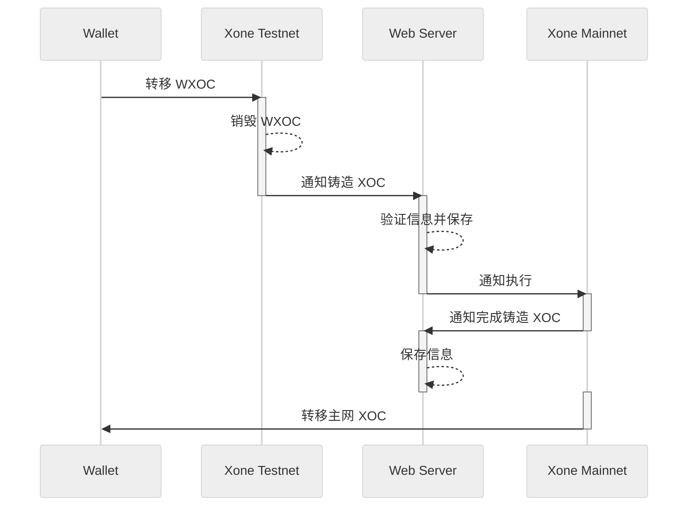

import { Steps, Callout } from 'nextra/components';
import {Card, CardHeader, CardBody, CardFooter, Divider, Link, Button} from "@nextui-org/react";
import {Table, TableHeader, TableColumn, TableBody, TableRow, TableCell} from "@nextui-org/react";
import ContactInfo from "@/components/ContactInfo";
import { Video } from '@components/Video';
import ImageViewer from '@components/ImageViewer';
import DynamicLangLink from '@components/LangLink.tsx';

# 欢迎来到 XOC 释放页面！

<Video src="video/release_pc.mp4"/>

本指南将帮助您快速了解为什么需要释放 XOC 以及如何顺利完成此过程。

## 为什么需要释放 XOC？

XOC 是 Xone 区块链的原生代币，而 WXOC（Wrapped XOC）是用于在 Xone 测试网上交互的映射代币。要在 Xone 主网上使用 XOC，您需要将 WXOC 兑换为 XOC。根据 XOC 代币经济模型，捐赠用户会收到 WXOC 代币，并根据计划比例线性获取。这个过程称为"释放"。

## 如何进行操作？

<Steps>
### 步骤 1：访问释放页面。

访问 Xone XOC 释放页面，开始释放您的 XOC。<Link className='text-primaryHue' isExternal showAnchorIcon href="https://bvi.xone.org/en/dynamics/release?pageNum=1&pageSize=10&startTime=1747655084000&endTime=1748259884000&address=">立即开始</Link>

<ImageViewer src="/images/Release_main.png" alt="释放主页面" />

### 步骤 2：连接您的钱包并检查。

将持有 WXOC 代币的钱包连接到我们的释放页面。在继续之前，请确保您连接的钱包包含可用于交互的 WXOC 代币和足够的 Gas 费用。

<ImageViewer src="/images/Release_Connect_Wallet.png" alt="连接钱包" />

<Button
  href="https://faucet.xone.org/"
  as={Link}
  className="top-6 rounded-md bg-primaryHue px-3.5 py-2.5 text-sm font-semibold text-white shadow-sm hover:bg-grd-500 focus-visible:outline focus-visible:outline-2 focus-visible:outline-offset-2"
  showAnchorIcon
  variant="solid"
>
  没有 Gas 费用？在此领取 >>
</Button>

### 步骤 3：自定义释放金额。

确认前序步骤后，输入您想要释放的 XOC 数量并确认交易。您的钱包将提示交易确认请求——请在继续之前验证合约地址和交易详情。

<ImageViewer src="/images/Release_Send_WXOC.png" alt="发送 WXOC" />

<Callout type="warning" emoji="⚠️">
  **注意：**  
  1. WXOC 与 XOC 的兑换比例为 **1:1**，无额外费用或管理费。  
  2. 您收到的 XOC 数量取决于您确认释放的 WXOC 数量。<DynamicLangLink className='text-primaryHue' showAnchorIcon basePath='/study' subPath='/release#how-do-i-calculate-the-tokens-i-can-release'>在此查看计算详情 >></DynamicLangLink>
  3. 一旦您的 WXOC 代币在合约上发送并确认，**将无法取回**，无论是从此页面发送还是通过其他方法发送。
</Callout>

### 步骤 4：等待 Xone 主网确认并检查。

成功将 WXOC 发送到 Xone 测试网合约地址后，主网合约将开始验证。确认后，您的主网钱包地址将收到相应数量的 XOC 代币。请切换到 **Xone 主网** 以检查您的余额。

</Steps>

## 关于释放机制

您可能仍不确定释放机制如何运作。下面，我们通过图示解释 Xone 捐赠计划的代币分配和释放机制。



您可能对图示仍有疑问。让我们深入了解这个过程：

1. **将 WXOC 发送到 Xone 测试网合约**  
  在 **Xone 主网上线后**，您需要将从捐赠中获得的 WXOC 代币发送到 **Xone 测试网合约地址**。合约收到您的代币后，将**销毁**它们并在服务器上记录**金额、地址和时间戳**等关键信息。

  🚨 *此步骤至关重要，因为它决定了您将在 Xone 主网上收到的 XOC 数量。*

2. **数据验证与锁定**  
  服务器**存储并验证**交易数据。确认后，它**通知 Xone 主网**继续进行 XOC 释放。在此阶段，测试网交易详情正式记录在主网上，这个过程在释放页面上称为**锁定**。然后，您的 XOC 代币将根据这些记录**线性**释放。

3. **逐步释放 XOC**  
  根据规则，**Xone 主网**上的合约将**开始释放 XOC** 到与测试网交互的钱包地址。释放遵循**线性时间表**，代币在**50 个纪元后每个纪元解锁**。

  🎉 *一旦过程开始，您的 XOC 代币将逐步发送到您的钱包！*

## 如何计算我可以释放的代币数量？

在我们开始计算之前，让我们了解<DynamicLangLink className='text-primaryHue' showAnchorIcon basePath='/study' subPath='/epoch'>什么是 Xone 纪元？</DynamicLangLink>在这里，我们假设第一个纪元将在主网启动时释放，因此在两年内将有 365 个纪元参与此次释放。由于我们必须在第一次释放后等待 50 个纪元，已释放纪元的总数为 315。

虽然我们根据 2 年的自然天数计算累积纪元数，但这并不是固定的。

它可能会因市场波动、基金会投票等原因进行调整，**但您可以放心，捐赠代币总数量的释放周期将保持不变，基于纪元的释放结算将保持不变，您可以获得的 XOC 数量也将保持不变**。

深入了解后，现在想象一个代表您在捐赠计划中获得的 WXOC 代币数量的值。例如：10,000.00

准备工作完成！接下来，让我们看看这次释放的 XOC 数量；从<DynamicLangLink className='text-primaryHue' showAnchorIcon basePath='/study' subPath='/wiki'>Xone 白皮书</DynamicLangLink>中我们可以知道，释放的 XOC 是捐赠部分，占总代币供应量的 10%，即：1,000,000,000.00。其中 5% 将在主网启动时释放，因此在第一天，将有 50,000,000.00 XOC 为捐赠计划释放。

<div className="overflow-x-auto">
```math
50{,}000{,}000 = 1{,}000{,}000{,}000 \times 5\%
```
</div>

接下来，我们将结合两个捐赠阶段的值 😊

<div className="overflow-x-auto">
  <Table key={new Date().getTime()} removeWrapper aria-label="XOC 募资表" className="mt-2">
    <TableHeader>
      <TableColumn key="mode">模式</TableColumn>
      <TableColumn key="time">时间</TableColumn>
      <TableColumn key="tokens">代币数量 (XOC)</TableColumn>
      <TableColumn key="price">价格<span>($)</span></TableColumn>
      <TableColumn key="fundraising">募资 (USDH)</TableColumn>
    </TableHeader>
    <TableBody>
      <TableRow key="1">
        <TableCell>私募</TableCell>
        <TableCell>2024-11-11～2024-12-01</TableCell>
        <TableCell>40,000,000.00</TableCell>
        <TableCell>0.05</TableCell>
        <TableCell>2,000,000.00</TableCell>
      </TableRow>
      <TableRow key="2">
        <TableCell>公募</TableCell>
        <TableCell>2024-12-11~2025-01-19</TableCell>
        <TableCell>300,000,000.00</TableCell>
        <TableCell>0.15</TableCell>
        <TableCell>45,000,000.00</TableCell>
      </TableRow>
    </TableBody>
  </Table>
</div>

最后，我们看到捐赠释放所需的总代币数量为 340,000,000.00。

此时，我们通过捐赠计划规则；在 Xone 主网上线后，捐赠者可以在第一个纪元释放的代币数量为：17,000,000.00 XOC。

<div className="overflow-x-auto">
```math
17{,}000{,}000=340{,}000{,}000 \times 5\%
```
</div>

那么您最终在第一个纪元可以释放：

<div className="overflow-x-auto">
```math
Release=Lock_{Token} \times 5\%
```
</div>

在上述内容中，我们假设您获得了 10,000.00 WXOC，那么通过计算，您可以立即在 Xone 主网上获得 500.00 XOC 的释放。

<Callout type="warning" emoji="⚠️">
  **释放:** 您可以获得的 XOC 数量。\
  **锁定WXOC:** 您在下一次释放点之前发送到 Xone 测试网合约的总金额。每次成功释放后，此值将被消除。
</Callout>

那么 50 个纪元后可以释放多少？让我们继续计算；在前面的内容中，我们提到了捐赠计划的总释放量以及两个捐赠阶段累积的代币总量。因此，我们可以推导出每次可以释放：

<div className="overflow-x-auto">
```math
每次释放=\frac{总代币数-初始数量}{未释放纪元数}
```
</div>

作为个人捐赠者，您将由您锁定的 WXOC 数量决定；因此，您将收到：

<div className="overflow-x-auto">
```math
个人释放=\frac{锁定_{代币}}{未释放纪元数}
```
</div>

<Callout type="warning" emoji="⚠️">
  文中的数据均为理论假设，不构成任何实际投资建议。
</Callout>

<ContactInfo />